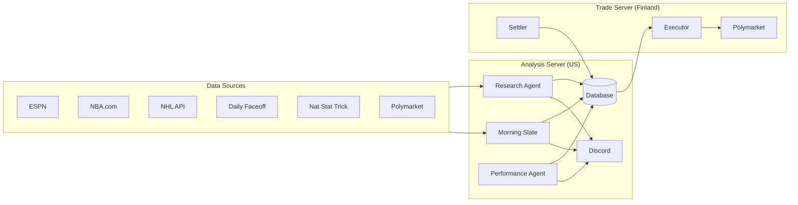

# Edgerunner

I built a system that predicts the outcomes of NBA and NHL games, finds cases where a prediction market has the odds wrong, and automatically places trades on those games. It ran autonomously for two weeks — pulling live data, making predictions, executing trades, grading itself overnight, and adjusting.

**Evaluated on 217 live predictions with a Brier score of 0.2078 — meaningfully better than the 0.25 baseline (coin-flip). Settled 31 trades at 18W-13L (58.1%).**

---

## Why This Matters

- **Decision-making under uncertainty.** The core problem — estimating probabilities from noisy, incomplete data and acting on them — is the same problem faced in finance, medicine, and policy. This project forced me to formalize that process end-to-end.
- **A real system, not a notebook.** This isn't a model that runs once in a Jupyter cell. It's ~120 files of production Python that ran unattended for weeks — pulling live APIs, executing on-chain trades, handling failures, and self-grading.
- **Quantified, honest evaluation.** Every prediction was logged and scored against reality. The model beat the baseline but also revealed where it fell short (NHL accuracy, negative closing line value). I report both.
- **Full-stack scope.** Probabilistic modeling, API integrations (6 sports data sources + blockchain trading), distributed systems (US analysis server + European trade execution server), database design, and automated monitoring.

---

## How It Works

Every morning, the system:

1. **Pulls today's games** from ESPN and NHL APIs and flags situational edges (back-to-backs, travel, rest mismatches)
2. **Builds a probability for each game** using a 3-layer model: team quality, game context, and injury/lineup information
3. **Compares its probability to the market price** on Polymarket to find mispriced games
4. **Sizes and executes trades** using Kelly criterion, 30 minutes before tip-off, via a server in Finland (Polymarket blocks US-based trading)
5. **Grades itself overnight** against actual outcomes, calculates accuracy scores, and feeds lessons back in

Everything reports to Discord — daily schedules, per-game analysis, trade confirmations, and nightly performance reports.



Analysis runs locally and writes signals to a shared database (Supabase). The trade server picks up signals, validates them against live prices, and executes. This split keeps the model centralized while working around Polymarket's geographic restrictions.

---

## Results

### Prediction Accuracy

| Metric | Value |
|--------|-------|
| Games graded | 217 |
| Overall Brier score | **0.2078** (lower is better; 0.25 = no skill) |
| NBA accuracy | Brier ~0.176 |
| NHL accuracy | Brier ~0.240 |
| Best single day | 0.1386 (12 games) |
| Worst single day | 0.2517 (14 games) |

### Trading

| Metric | Value |
|--------|-------|
| Trades settled | 31 |
| Record | 18W-13L (58.1%) |
| Win/loss size ratio | 1.40x |

Net profitable — winners were sized larger than losers through Kelly criterion position sizing.

### What I Learned

1. **Prediction markets are more efficient than I expected.** The market was pricing in the same signals I was using, just slightly faster. My closing line value (a measure of whether you bought at a better price than where the market settled) was consistently negative.
2. **The model's edge came from context the market underpriced** — rest mismatches, travel fatigue, injury stacking — roughly 5-15% of games.
3. **NHL is fundamentally harder to predict than NBA** (Brier 0.240 vs 0.176). Lower-scoring games and goalie variance make hockey more random.
4. **Conservative bet sizing is essential.** Quarter Kelly (betting 25% of the theoretically optimal amount) kept the system alive through losing streaks where full Kelly would have caused ruin.

---

## Demo / Sample Output

**Morning slate** — triages every game by situational edges:
```
Morning Slate — Thursday
19 games | Deep: 13 | Standard: 6

NBA (8 games)
  [DEEP] LAL B2B @ MIA — 8:00 PM ET
    Rest: LAL 1d / MIA 2d | Travel: LAL crossed 3 zones
  [DEEP] CLE @ CHI B2B — 8:00 PM ET
    Rest: CLE 2d / CHI 1d
  [STD]  ORL @ CHA — 7:00 PM ET

NHL (11 games)
  [DEEP] FLA @ EDM — 9:00 PM ET
    Travel: FLA crossed 2 zones | Goalies: Sergei Bobrovsky
```

**Per-game prediction** — full probability decomposition:
```
Phoenix Suns @ Orlando Magic [NBA]

Layer 1 (Base):     54% away (Suns)
Layer 2 (Context):  +2.1% → 56%  (PHX rested, ORL on B2B)
Layer 3 (Info):     +1.4% → 57%  (ORL missing F. Wagner)

Final: Suns 57% | Market: 50% | Edge: 7.7%
Signal: BET
```

**Trade execution:**
```
TRADE EXECUTED
  Philadelphia 76ers | NBA
  Buy @ 0.480 | Model: 84.8% | Edge: 33.2%
```

**Overnight grading:**
```
Graded 12 games

  [+] LA Clippers @ Indiana:   pred=19%  actual=away  Brier=0.0359
  [+] Chicago @ OKC Thunder:   pred=95%  actual=home  Brier=0.0025
  [-] Detroit @ Buffalo:        pred=63%  actual=away  Brier=0.4009
  [+] Utah Jazz @ Denver:      pred=95%  actual=home  Brier=0.0025

Daily Brier: 0.1386
Settlement: 2W-1L
```

---

## My Contributions

Built with Claude (Anthropic) as a coding partner.

**I designed:**
- The system architecture — splitting analysis and execution across two servers, using a shared database as the communication layer
- The 3-layer prediction framework — the decision to decompose predictions into base quality, situational context, and information edges rather than building one monolithic model
- Sport-specific tuning — different edge thresholds, form caps, and home advantage models for NBA vs NHL, informed by domain knowledge (why xGF% matters in hockey, how back-to-backs affect NBA outcomes differently than NHL)
- Risk management approach — quarter Kelly sizing, circuit breakers that halt trading when accuracy degrades, closing line value tracking

**I implemented (with AI assistance):**
- ~120 Python files: model logic, 6 data source integrations, trading executor, performance grading agents, tests
- Polymarket blockchain integration (wallet setup, on-chain trade execution and position redemption via Gnosis Safe)
- Database schema (8 migrations), Discord monitoring (3 bots, 7 channels), VPS deployment and networking
- Backtested on 1,131 NBA games to validate model parameters before going live

**I tested and iterated:**
- Ran live for 2 weeks, grading every prediction against outcomes nightly
- Discovered through live performance data that NHL form adjustments needed tighter caps (3% vs 5%)
- Validated the diminishing returns model for stacked injuries (100%/50%/25%) against backtest data
- Calibrated shrinkage factors (how much to compress extreme predictions toward 50%) per sport

---

## The Prediction Model

The model builds a win probability for each game by combining three independent signals.

### Layer 1: Team Quality

**NBA** uses offensive and defensive ratings per 100 possessions (from NBA.com), converted to win probability via logistic regression. Validated on 1,131 games: Brier 0.2094 vs 0.2219 for the simpler Elo model.

**NHL** uses an Elo-based model blended with expected goals percentage (xGF%) — a stat that strips out shooting luck to estimate how well a team is actually playing.

Key formulas:
```
Elo = 1500 + 400 * log10(Win% / (1 - Win%))
P(Home) = 1 / (1 + 10^(-(EloHome - EloAway + HCA) * Shrinkage / 400))
```

Shrinkage (0.70 NBA, 1.00 NHL) compresses extreme predictions toward 50% — critical because raw stats overstate true talent gaps, especially in the NBA.

### Layer 2: Game Context

Adjustments for factors the baseline doesn't capture:

| Factor | NBA | NHL |
|--------|-----|-----|
| Back-to-back penalty | 3.5% | 2.5% |
| Rest advantage | 1.2%/day | 1.0%/day |
| Travel fatigue | 1.0%/timezone crossed | 1.2%/timezone crossed |
| Recent form (last 10) | Cap +/-5% | Cap +/-3% |
| Head-to-head record | Cap +/-3% | Cap +/-3% |

NHL caps are tighter because hockey outcomes are more random — a hot streak is less predictive in the NHL than the NBA. All NHL situational adjustments are capped at +/-5% total to prevent compounding.

### Layer 3: Information Edge

Player availability shifts, tiered by importance:

| Player tier | Impact when out |
|-------------|-----------------|
| MVP-caliber (Jokic, McDavid) | 5-8% |
| All-Star | 3-5% |
| Quality starter | 1-3% |
| Role player | 0.5-1% |

**Diminishing returns:** If a team is missing multiple players at the same tier, each additional absence has less impact (100% / 50% / 25%) — because the replacement talent pool is already being used. Total impact capped at +/-15%.

### Combining

```
Final_Prob = Clamp(Base + Situational + Information, 0.05, 0.95)
```

The 5-95% clamp prevents the model from ever expressing certainty, which would catastrophically penalize Brier scores on upsets.

---

## Edge Detection & Bet Sizing

The model compares its probability to the Polymarket price, adjusting for the bid-ask spread:

```
Effective_Edge = Model_Prob - True_Implied_Prob - 0.5% (slippage)
```

Trades only execute when edge exceeds sport-specific thresholds (1.5% NBA, 4% NHL same-day). NHL thresholds are higher because the model is less accurate there.

**Position sizing** uses the Kelly criterion — a formula from information theory that determines the optimal bet size given your edge and the odds:

```
Kelly = (Model_Prob - Ask) / (1 - Ask)
Position = Bankroll * Kelly * 0.25  (quarter Kelly for safety)
```

Quarter Kelly sacrifices ~44% of theoretical growth rate but reduces drawdowns by ~75%.

---

## Safety & Risk Management

- **Circuit breakers** halt all trading if daily Brier exceeds 0.35 (model failure) or closing line value stays negative for 7+ days (model adding negative information)
- **Sanity checks** on every prediction: probability bounds, market divergence limits, impact magnitude caps
- **Stale signal guard** rejects trades if the market price moved >1.5% since analysis
- **Shadow testing** runs old and new models in parallel during upgrades to catch regressions
- **Full audit trail** — every prediction logged with all inputs, layer outputs, market data, and model version

---

## Technical Details

<details>
<summary>Data sources and caching</summary>

| Source | Data | Sport |
|--------|------|-------|
| ESPN API | Scoreboard, injuries, rosters | NBA |
| NBA.com Stats | ORtg, DRtg, NetRtg, Pace | NBA |
| NHL API | Schedule, scores, standings | NHL |
| Daily Faceoff | Confirmed goalie starts | NHL |
| Natural Stat Trick | xGF%, Corsi, Fenwick | NHL |
| Polymarket CLOB | Live orderbook, execution | Both |

Cache policy: Team stats 24h, injuries 30min, market prices 5min. Goalie starts **never cached**.
</details>

<details>
<summary>Ensemble model (Layer 4)</summary>

An optional blend of the base model with market prices using online logistic regression (7 features, L2-regularized, retrains every 25 games). Market price consistently emerges as the strongest feature — the model's value comes from the marginal edges where markets are wrong, not from replacing market consensus.

```
P = 0.45 * Model_Prob + 0.55 * Market_Price
```

When the model's recent closing line value is positive (beating the market), the blend dynamically shifts more weight to the model.
</details>

<details>
<summary>Infrastructure</summary>

- **Database:** Supabase (PostgreSQL) — 7 tables: games, research, trades, calibration, clv, ensemble_training, prediction_lineage
- **Analysis server:** Local machine running cron jobs (morning slate, research agent, alert daemon, performance grading)
- **Trade server:** Hetzner VPS in Helsinki — executor, settler, CLV capture, lineup monitor
- **Networking:** Tailscale private network between servers
- **Monitoring:** 3 Discord bots across 7 channels
- **Blockchain:** Polymarket CLOB API, Gnosis Safe batch redemptions on Polygon
</details>

<details>
<summary>Project structure</summary>

```
src/
├── model/        # Probability model (baseline, situational, info, edge, ensemble, safety)
├── agents/       # Research agent (~1600 lines), alert agent, performance agent
├── data/         # 6 data source integrations (ESPN, NBA.com, NHL, Daily Faceoff, NST, Polymarket)
├── trading/      # Trade executor + settlement
├── domain/       # Core data structures
├── repositories/ # Database access layer
└── services/     # Prediction and training pipelines

scripts/          # VPS executor, CLV capture, lineup monitor, backtesting, recalibration
migrations/       # 8 Supabase SQL migrations
tests/            # Unit + integration tests
```
</details>

<details>
<summary>Setup</summary>

Requires Python 3.12+, Supabase, Polymarket wallet, non-US VPS, Discord bots.

```bash
# Run migrations
psql $DATABASE_URL -f migrations/001_create_tables.sql  # through 008

# Daily pipeline
python3 src/scripts/morning_slate.py       # Pull schedule
python3 -m src.agents.research_agent       # Run predictions
python3 scripts/vps_executor.py --dry-run  # Preview trades
```
</details>

---

## License

This project is provided as-is for educational purposes. Sports betting involves financial risk. Past performance does not guarantee future results.
